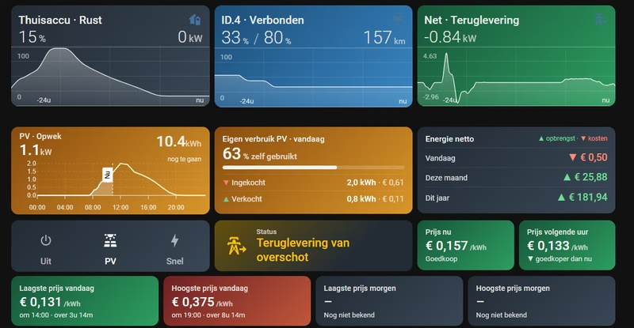
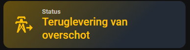
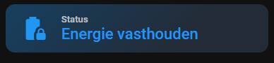

# ha-helpers

Home Assistant packages, blueprints en dashboard-cards voor een installatie met een
**Sigenergy** thuisbatterij (SigenStor), **evcc**, **Zonneplan** dynamische stroomprijzen
en een elektrische auto.



| | |
|---|---|
| [`packages/sigen_energiestatus.yaml`](packages/sigen_energiestatus.yaml) | Eén leesbare status-sensor voor je Sigen-installatie, plus stroomrichting-sensoren zonder geflapper |
| [`blueprints/automation/puitv/`](blueprints/automation/puitv/) | evcc: PV-laden blokkeren zolang de batterij aan het net verkoopt |
| [`dashboards/energie-cast/`](dashboards/energie-cast/) | "Energie Cast" dashboard-view, met elke card in een eigen bestand |

## Package: Sigen energiestatus

Maakt `sensor.sigen_energiestatus` aan met één van deze statussen:

 

*De status-card uit het dashboard ([`cards/energiestatus.yaml`](dashboards/energie-cast/cards/energiestatus.yaml)) krijgt per status een eigen kleur en icoon.*

| Status | Betekenis |
|---|---|
| Batterij verkoop | Batterij ontlaadt meer dan het huis verbruikt en levert terug |
| Batterij inkoop | Batterij laadt uit het net |
| Teruglevering van overschot | Zon-overschot gaat naar het net |
| Eigen verbruik (uit batterij) | Huis draait op de batterij |
| Eigen verbruik (zon laadt batterij) | Zon-overschot gaat de batterij in |
| Eigen verbruik (zon dekt huis) | Zon dekt precies het verbruik |
| Energie vasthouden | Afname uit het net terwijl de batterij niet ontlaadt |
| Batterij leeg | State of charge op of onder de backup/cut-off-reserve |

Daarnaast vier `binary_sensor`s (net afname/teruglevering, batterij laden/ontladen) met een
drempel van 100 W en een vertraging van 20 s. De standaard Sigen binary sensors schakelen al
bij 10 W en flapperen daardoor rond 0 kW.

**Vereist:** de [Sigenergy integratie](https://github.com/TypQxQ/Sigenergy-Local-Modbus)
(`sensor.sigen_plant_*` entiteiten).

**Installatie:**
1. Kopieer het bestand naar `/config/packages/`.
2. Zet dit in `configuration.yaml` (als het er nog niet staat):
   ```yaml
   homeassistant:
     packages: !include_dir_named packages
   ```
3. Herstart Home Assistant.

## Blueprint: evcc PV-laden blokkeren tijdens batterijverkoop

[](https://my.home-assistant.io/redirect/blueprint_import/?blueprint_url=https%3A%2F%2Fgithub.com%2Fpuitv%2Fha-helpers%2Fblob%2Fmain%2Fblueprints%2Fautomation%2Fpuitv%2Fevcc_block_pv_charging_while_battery_selling.yaml)

Zet de evcc-laadmodus op **off** zolang `sensor.sigen_energiestatus` op "Batterij verkoop"
staat, en daarna weer op **pv**. Zo laadt de auto niet op batterijstroom die je op dat moment
verkoopt. Handmatig gekozen modi zoals *now* of *minpv* laat de blueprint met rust.
Optioneel kun je acties toevoegen, bijvoorbeeld een notificatie, met `{{ status }}` in de tekst.

**Vereist:** het package hierboven en de [evcc integratie](https://github.com/marq24/ha-evcc)
(een `select`-entiteit voor de laadmodus).

## Dashboard: Energie Cast

Een sections-view met thuisaccu, auto, net, PV-opwek, eigen verbruik, evcc-laadmodus,
energiestatus en stroomprijzen (nu, volgend uur, laagste/hoogste vandaag en morgen, grafiek),
zie de screenshot bovenaan.

De bovenste rij (thuisaccu, auto, net) en de PV-card wisselen automatisch van kleur en titel
op basis van de toestand, bijvoorbeeld *Thuisaccu · Laden / Ontladen / Rust* en
*Net · Afname / Teruglevering / Neutraal*. Het blok met de knoppen *Uit / PV / Snel* zet de
evcc-laadmodus.

```
dashboards/energie-cast/
├── view.yaml     de view, met een !include per card
└── cards/        één bestand per card
```

**Vereiste HACS frontend-cards:** [button-card](https://github.com/custom-cards/button-card),
[mini-graph-card](https://github.com/kalkih/mini-graph-card),
[apexcharts-card](https://github.com/RomRider/apexcharts-card),
[card-mod](https://github.com/thomasloven/lovelace-card-mod).

**Entiteiten:** de cards gebruiken de entity-id's van mijn installatie. Pas ze aan naar die
van jou:
- Sigen: `sensor.sigen_plant_*`, `sensor.sigen_inverter_*`, `binary_sensor.sigen_plant_*`
- Zonneplan: `sensor.zonneplan_*`
- evcc: `select.evcc_laadpaal_mode`, `binary_sensor.evcc_laadpaal_*`, `sensor.evcc_forecast_solar`
- Auto (VW ID.4): `sensor.id_4_*`

**Gebruiken:**
- **Eén card:** open het bestand in `cards/`, kopieer de inhoud en plak die in de UI via
  *Card toevoegen → Handmatig*.
- **De hele view als YAML-dashboard:** kopieer `dashboards/energie-cast/` naar
  `/config/dashboards/` en voeg dit toe aan `configuration.yaml`:
  ```yaml
  lovelace:
    dashboards:
      energie-cast:
        mode: yaml
        filename: dashboards/energie-cast.yaml
        title: Energie Cast
        icon: mdi:lightning-bolt
        show_in_sidebar: true
  ```
  met `dashboards/energie-cast.yaml`:
  ```yaml
  title: Energie Cast
  views:
    - !include energie-cast/view.yaml
  ```

## Licentie

[MIT](LICENSE)
